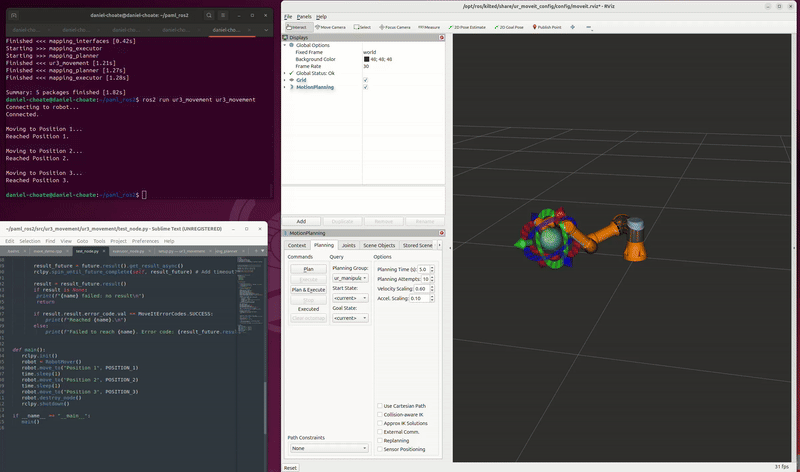

# Pose-Aware Mapping and Localization (PAML) 

This project consists of a two-phase mapping and localization pipeline for a UR3 robot arm equipped with a realsense RGB-D sensor, and a mobile robot used for the localization phase. Phase 1 consists of the reference map generation phase using vision-based reconstruction techniques. Phase 2 enables localization for a mobile robot moving through the pre-mapped environment. 

## Phase 1: Reconstruction for high-resolution reference map 

During the reference map generation phase, the UR3 arm will execute a trajectory of poses to encompass full scene capture. At each pose, the system will capture RGB-D data, as well as pose information to be used for map reconstruction. Known poses allow for a diffusion approach, rather than a SLAM approach which requires pose estiamtion. The pose-aware aspect adds accuracy confidence in our reference map. The output of this phase will be a high resolutin 3D map of the environment. 

## Phase 2: Localization pipeline 

During the localization phase, a turtlebot wil execute a trajectory plan to travel across the previously mapped environment. At each timestep, a comparison to the reference map, using an ICP-style algorithm, will provide a global map state estimate to be used by Nav2 for velocity control.

# Relevant Commit IDs
- Initial Implementation: 30243fc
- Added mapping client: f64cc83
- Implementing moveit for ur3 - demo example: 4b71fc8 
- Initial moveit implementation, still working through full trajectory: 6750ae8
- Updated moveit implementation, have control nodes for joint angles and end effector: b5a131a  
- Initial perception implementation - RGBD from intel Realsense d435i: 5dccdae
- Linked mapping client to moveit to execute custom trajectory: 52020e5
- Map builder custom node and Nav2 implementation: TODO 

#### Plan for external tools 
- MoveIt
- Nav2
- TSDF fusion (NVlabs)

##### Progress

![Custom map builder (not pose-aware)] (msc/mapping_demo.gif)

TODO List 
- [ ] Package setup for phase 1
	- [x] mapping_planner
	- [x] mapping_executor
	- [x] MoveIt
	- [x] ur3_driver
	- [x] realsense_driver 
	- [x] RGBD_capture 
	- [x] map_builder 
	- [x] map_server
	- [ ] robot_state_publisher 
- [ ] Package setup for phase 2

*Phase 1 progress*
- [ ] mapping_planner 
	- [x] basic pose generator for demo
	- [x] initial rviz verification
	- [ ] adjust for specific scene
	- [ ] add filtering for reachability
	- [ ] optimize for smooth execution 
- [ ] mapping_executor
	- [x] basic setup for trajectory execution 
	- [x] mapping_client setup for specific scene 
- [ ] MoveIt
	- [x] basic demo for moving UR3 
	- [x] visualize in rviz
- [ ] ur3_driver
	- [x] basic implementation for UR3 movement
	- [x] link mapping client to moveit to execute trajectory 
- [x] realsense_driver 
- [ ] RGBD_capture 
	- [x] initial setup - basic data subscriber
	- [ ] link to tf tree
- [x] map_builder 
- [x] map_server
- [ ] robot_state_publisher 
	- [ ] link tf poses 

*Phase 2 progress*
- [ ] localization bringup 
	- [x] initial package setup
	- [x] link to turtlebot
	- [ ] state machine for localization pipeline
- [ ] map server bridge
	- [ ] link phase1 map to nav2
